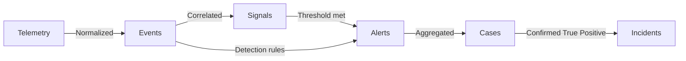

# Detection & Response Lifecycle

The Detection & Response Lifecycle is the framework's core pipeline: telemetry is normalized into Events, Events raise Signals and Alerts, Alerts are aggregated into Cases, and confirmed Cases become Incidents. This document is the high-level overview of that pipeline and of the four operational phases that operate it, and maps the phases to the NIST, ISO and EU regulatory lifecycles. The detailed process of each phase, including its inputs and outputs, lives in the phase documents linked below.

## The Lifecycle Pipeline

### Cardinality Remarks
*   **1 Signal / Alert** can contain **many Events**.
*   **1 Case** can contain **many Alerts**.
*   **1 Incident** is a confirmed Case — the same OCSF `Incident Finding [2005]` object, promoted when its `verdict_id` transitions to **True Positive (`2`)** (see [Definitions](../01-Foundation/definitions.md)). Cases → Incidents is a verdict transition on one object, not a new object.

## The Operating Loop and Its Asynchronous Feeds

Phases 2, 3 and 4 form the **operating loop**, driven by the Alerts entering the pipeline. Each stage runs for a shrinking subset of them: Alerts that survive the deduplication and rate-throttling rules applied at reception ([Detection & Analysis §1.1](02-detection_and_analysis.md#11-reception-aggregation-and-assignment)) are aggregated into Cases and reach **Phase 2.a Triage**; only Cases promoted at triage reach **Phase 2.b Investigation**; only Cases confirmed as Incidents reach **Phase 3 Incident Response**; and **Phase 4 Post-Incident Activity** follows a completed response or a critical False Positive. Cases dispositioned as False Positive or Benign leave the loop at the stage that dispositioned them. Phase 1 is **asynchronous**: it engineers and maintains the detections and the telemetry pipeline that feed the loop, and it consumes the loop's tuning feedback (False Positive and Benign dispositions from Phase 2, action items from Phase 4). The loop therefore closes twice: Phase 4 → Phase 1, and Phase 2 dispositions → Phase 1.

Two further entry paths feed the loop asynchronously and are governed in [Detection & Analysis](02-detection_and_analysis.md): **threat hunting** opens Cases for adversary activity that no rule caught and enters the loop at Investigation (the hunter has already done the triage work), and **out-of-band intake** opens Cases for suspected incidents reported from outside the alert pipeline and enters at Triage. Signals do not trigger triage; they are consulted during it.

## Phase I/O Contract

Each phase and sub-phase consumes and produces defined artifacts. Where a Case moves forward — promotion from Triage to Investigation, confirmation of an Incident into Response — the data it carries is an OCSF-aligned [**phase transition contract**](../01-Foundation/definitions.md#phase-transition-contract), whose field schema is defined once in [Playbook Architecture §5](../04-Playbooks/playbook_architecture.md#5-phase-transition-contracts-ocsf-aligned). A promoted Case carries no verdict: `verdict_id` stays open until Investigation resolves it. A closed Case terminates the flow with its verdict and carries no contract; Phase 1 has no contract because it feeds the loop with detections, not with Cases. This table is the plain-language summary; each phase document states its own contract authoritatively.

| Phase / sub-phase | Consumes (input) | Produces (output) |
|---|---|---|
| **Phase 1 · Preparation & Engineering** | Raw telemetry; tuning feedback (Phase 2 False-Positive/Benign dispositions, Phase 4 action items); new TTPs / threat intelligence; CMDB asset inventory | Normalized OCSF **Events**; **Signals** (Informational `Detection Finding`) and **Alerts** (`Detection Finding`, `severity_id ≥ Low`); a monitored, healthy telemetry pipeline; exception/allow lists; a maintained SOC Knowledge Base |
| **Phase 2.a · Triage** *(object = Alerts)* | **Alert(s)** (`severity_id ≥ Low`) aggregated into a **Case** (`Incident Finding`); enrichment sources (TI, CMDB, identity, SOC Knowledge Base); the active-Cases store. Signals do not trigger triage; they are consulted during it. | **Exactly one of:** (a) **Closed Case** — `verdict_id` False Positive (`1`), Benign (`5`) or Duplicate (`10`) (FP → tuning signal to Phase 1); (b) **Case promoted to Investigation** + Triage → Investigation phase transition contract. *No confirmed Incident at this stage.* |
| **Phase 2.b · Investigation** *(object = hypothesis)* | Promoted Case + Triage → Investigation phase transition contract | **Exactly one of:** (a) **Closed Case** — Benign hypothesis proven, or Duplicate (FP → tuning ticket to Phase 1); (b) **Confirmed Incident** — Malicious hypothesis proven → `verdict_id = 2` (True Positive) + definitive Incident Category + scope/impact/timeline + Investigation → Response phase transition contract. Incident declaration and notification ([Detection & Analysis §3](02-detection_and_analysis.md#3-incident-declaration--notification)) trigger here. |
| **Phase 3 · Incident Response** | Confirmed Incident + Investigation → Response phase transition contract | Contained/eradicated/recovered environment; regulatory notifications (NIS2 / DORA deadlines); transition to Phase 4 (incident record, actions, metrics) |
| **Phase 4 · Post-Incident Activity** | Completed IR (confirmed Incident that reached Containment, or a critical False-Positive outage) + incident record/metrics | Blameless RCA (four systemic buckets) + action items → rule tuning/creation (Phase 1), Playbook updates, SOC Knowledge Base updates (lessons learned), IT config/patch requests |

## Standard & Regulatory Alignment Matrix

Because different international frameworks define their incident lifecycles with varying boundaries, ZeroSOC maps its operational phases to the corresponding segments of NIST, ISO and the EU regulations:

| ZeroSOC Operational Phase | NIST CSF 2.0 Function | NIST SP 800-61 Rev. 3 Profile Segment | ISO/IEC 27035:2023 Phase | NIS2 relevance | DORA relevance |
| :--- | :--- | :--- | :--- | :--- | :--- |
| **Phase 1: Preparation & Engineering** | Govern (GV), Protect (PR), Identify (ID) | **Table 2:** Preparation | **1. Plan and Prepare** | Art. 21 risk-management measures: logging, asset classification, incident-handling capability | Art. 9–10 ICT protection and detection: logging, monitoring, anomaly detection |
| **Phase 2: Detection & Analysis** | Detect (DE), Respond (RS.MA – Triage) | **Table 3:** Incident Response (Detect) | **2. Detect and Report** **3. Assess and Decide** | Art. 21 incident handling: detection and assessment of significant incidents | Art. 17–18 incident management process and classification of major incidents |
| **Phase 3: Incident Response** | Respond (RS), Recover (RC) | **Table 3:** Incident Response (Respond & Recover) | **4. Respond** | Art. 23 early warning within **24h**, incident notification within **72h** | Art. 19 initial notification (**4h** from classification, **24h** from awareness), intermediate report within **72h** |
| **Phase 4: Post-Incident Activity** | Identify (ID.IM) | **Table 2:** Lessons Learned (Identify Improvement) | **5. Learn Lessons** | Art. 23 final report within **1 month** | Art. 19 final report within **1 month** of the intermediate report |

### Critical Alignment & Translation Notes:
1. **The Lessons Learned Feedback Loop:** While NIST SP 800-61 Rev. 3 groups lessons learned (Identify–Improvement) alongside preparation in Table 2, ZeroSOC isolates these tasks operationally in **Phase 4: Post-Incident Activity**. The output of Phase 4 is fed back into **Phase 1** to update detection configurations.
2. **Assessment & Promotion boundaries:** ISO/IEC 27035 separates the identification of an event (Detect & Report) from the decision that it is an incident (Assess & Decide). ZeroSOC maps both segments into **Phase 2: Detection & Analysis**, where Alerts are aggregated into Cases, investigated, and promoted to Incidents.
3. **Notification deadlines** are regulatory reporting obligations owned by the SOC Manager; they are distinct from the framework's measurement gates (G1–G5), which are quantitative funnel checkpoints defined in [Operational Metrics](../05-Metrics/operational_metrics.md).

---

## Phase 1: Preparation & Engineering
*   **Objective:** Capturing raw telemetry, normalizing it into queryable Events, and engineering the detection logic.
*   **Functions:** [Detection Engineer](../01-Foundation/definitions.md#6-executors-and-functions) and [Security Platform Engineer](../01-Foundation/definitions.md#6-executors-and-functions)
*   **Process Flow:** Telemetry is ingested and normalized into Events. Detection rules are created and continuously tuned. Health monitoring ensures data integrity. Runs asynchronously to the operating loop.
*   **Detailed Process:** [01-preparation_and_engineering.md](01-preparation_and_engineering.md). The Phase 1 standard is intentionally concise in this release; its expansion (Detection-as-Code catalog, detection assurance) is staged on the [Roadmap](../01-Foundation/roadmap.md).

## Phase 2: Detection & Analysis
*   **Objective:** Identifying security-relevant Signals, generating Alerts, and investigating Cases in order to identify Incidents.
*   **Sub-phases:** **Phase 2.a — Triage** (System 1: verify, enrich, prioritize, decide Close-or-Promote) and **Phase 2.b — Investigation** (System 2: concurrent Malicious/Benign hypothesis testing to a verdict).
*   **Functions:** [Security Analyst](../01-Foundation/definitions.md#6-executors-and-functions) and [Threat Hunter](../01-Foundation/definitions.md#6-executors-and-functions).
*   **Process Flow:** Execution of detection logic against Events produces Signals and Alerts. Alerts are triaged into Cases; promoted Cases are investigated to a verdict. Threat hunting and out-of-band intake open Cases into the same flow.
*   **Detailed Process:** [02-detection_and_analysis.md](02-detection_and_analysis.md)

## Phase 3: Incident Response
*   **Objective:** Containing and eradicating confirmed threats (Incidents) and recovering affected services.
*   **Functions:** [Security Analyst](../01-Foundation/definitions.md#6-executors-and-functions) owning the Incident; [SOC Manager](../01-Foundation/definitions.md#6-executors-and-functions) for enterprise coordination and regulatory notification.
*   **Process Flow:** Cases confirmed as True Positives become Incidents. Execution of containment guardrails and eradication playbooks to restore services.
*   **Detailed Process:** [03-response.md](03-response.md)

## Phase 4: Post-Incident Activity
*   **Objective:** Feeding tuning data back into Phase 1 based on True Positive or critical False Positive findings.
*   **Functions:** [SOC Manager](../01-Foundation/definitions.md#6-executors-and-functions), [Detection Engineer](../01-Foundation/definitions.md#6-executors-and-functions) and the [Security Analyst](../01-Foundation/definitions.md#6-executors-and-functions) who owned the Incident.
*   **Process Flow:** Conducting blameless post-mortems and generating actionable tickets for continuous improvement.
*   **Detailed Process:** [04-post_incident_activity.md](04-post_incident_activity.md)
