# Phase 1: Preparation & Engineering

> **Draft — placeholder for this release.** Phase 1 is intentionally the least developed process document: it states the minimum the operating loop depends on (the detection lifecycle, the tuning loop, log-source health) and no more. Its expansion — a detection-rule catalog with Detection-as-Code conventions and detection assurance — is staged on the [Roadmap](../01-Foundation/roadmap.md) (P3, P5). Expect this document to change substantially in a later release.

This phase encompasses all proactive activities required to prepare the SOC to detect and respond to threats effectively. It governs the lifecycle of detection logic and the continuous monitoring of the telemetry pipeline. It runs asynchronously to the operating loop described in the [Detection & Response Lifecycle](00-detection_and_response_lifecycle.md): the [Detection Engineer](../01-Foundation/definitions.md#6-executors-and-functions) owns §1 and the [Security Platform Engineer](../01-Foundation/definitions.md#6-executors-and-functions) owns §2. Both maintain the [SOC Knowledge Base](../01-Foundation/definitions.md#soc-knowledge-base-soc-kb) that Triage consults for organizational context.

## Inputs & Outputs

*   **Consumes:** raw **Telemetry** from onboarded log sources; tuning feedback — False-Positive/Benign dispositions from [Phase 2](02-detection_and_analysis.md) and Post-Incident action items from [Phase 4](04-post_incident_activity.md); new adversary TTPs / threat intelligence; and the CMDB asset inventory.
*   **Produces:** normalized OCSF **Events**; active **detection logic** (the Detection-as-Code pipeline) that emits **Signals** (Informational `Detection Finding`) and **Alerts** (`Detection Finding`, `severity_id ≥ Low`); a monitored, healthy telemetry pipeline; and current exception/allow lists.

## Process Flowchart

```mermaid
graph TD
    subgraph "Detection Engineering & Tuning"
        P[Propose Rule] --> S[Test in Silent Mode]
        S -->|"Acceptable FPR"| A[Deploy Active Mode]
        A --> M[Monitor & Tune Precision]
        M -->|"FPR threshold violated / Obsolete"| D[Deprecate Rule]
        M -->|"Noise/Exception identified in Triage"| T[Tune Rule & Exception Lists]
        T --> M
    end

    subgraph "Log Source Health Monitoring"
        H[Define Expected EPS & Heartbeat] --> AM[Automated Health Monitoring]
        AM -->|"Heartbeat Violation / EPS Drop / Parsing Error"| HA[Fire Health Alert]
        HA --> VC[Verify Collector]
        VC --> VN[Verify Network]
        VN --> VS[Verify Source Device]
        VS -->|"Requires Infrastructure Changes"| E[Escalate to IT/NetOps]
        AM -->|"Monthly Audit"| Inventory[Compare Active vs CMDB Master Asset Inventory]
    end
```

## 1. Detection Engineering & Tuning

This sub-process governs the lifecycle of detection logic, ensuring the SOC maintains a high signal-to-noise ratio and meets its [Detection Precision](../05-Metrics/operational_metrics.md#51-detection-precision) KPO (see [Definitions §5](../01-Foundation/definitions.md#5-measurement--performance-terminology) for the metric/KPI/KPO chain).

### 1.1 Rule Lifecycle (Detection-as-Code Pipeline)
All rules follow a GitOps-based Detection-as-Code (DaC) pipeline to ensure stability, precision, and version control:
1.  **Drafting:** Authors propose detection logic using vendor-independent schemas.
2.  **Lint & Validate:** Automated syntax checkers validate schema compliance.
3.  **Unit Testing:** Validate rule logic against mock or historical telemetry datasets to verify correctness.
4.  **Peer Review:** Mandatory security peer review (human or agent) of rule logic.
5.  **Shadow Deployment (Silent Mode):** Rules run in "shadow mode" against live production data, triggering notifications but bypassing standard triage and paging channels. During shadow mode, automated adversary emulation simulations run to verify detection efficacy and precision.
6.  **Active Promotion:** Once the precision rate is verified below the False Positive Rate (FPR) threshold, the rule is merged to the main branch and promoted to active alerting status.
7.  **Continuous Tuning & Deprecation:** Deprecate rules when TTPs become obsolete or precision repeatedly falls short of its KPO.

### 1.2 Tuning False/Benign Positives
When an alert is dispositioned as a False Positive or Benign Positive during Triage, the executor must document the precise attribute causing the noise (e.g., a specific IP, a specific scheduled task name). 
The Detection Engineer function reviews these exceptions weekly to modify the core rule logic or update central exception lists.

Every tuning ticket carries the source Case ID; when the resulting rule change reaches Active Promotion (§1.1 step 6), the deployment closes the loop and stamps **Tuning Loop Latency** ([Operational Metrics §5.8](../05-Metrics/operational_metrics.md)).

### 1.3 Automated Adversary Emulation
To validate that active rules remain functional over time and to confirm new rules are precise:
*   **Emulation Mapping:** Every detection rule should be mapped to one or more automated adversary emulation tests; making this mandatory is the Detection Assurance bet on the [Roadmap](../01-Foundation/roadmap.md).
*   **Continuous Emulation Sprints:** Emulation tests run continuously in testing environments to detect rule regression (e.g., changes in log structure that break parsing).
*   **Failed Emulation Workflows:** If an emulation test fails to trigger a rule, it automatically generates a high-priority tuning exception in the engineering backlog.

---

## 2. Log Source Health Monitoring

The most critical failure mode in a SOC is the "silent failure"—when a log source stops sending data, but no alert is generated. This process ensures the continuous integrity of the [Telemetry](../01-Foundation/definitions.md#telemetry-raw-data) pipeline.

### 2.1 Defining "Healthy"
For every onboarded log source, the SOC must define:
*   **Expected Event Rate (EPS):** The baseline volume of data expected during normal operations.
*   **Heartbeat Cadence:** The maximum acceptable time between log messages before an outage is declared.

### 2.2 Automated Health Alerting
The SIEM or data lake must generate an operational alert (distinct from a [Security Alert](../01-Foundation/definitions.md#security-alerts)) when:
1.  A log source stops sending data entirely (violates heartbeat cadence).
2.  The EPS drops significantly below the expected baseline (partial failure).
3.  The data structure changes, causing parsing failures or OCSF mapping errors.

### 2.3 Troubleshooting Workflow
When a health alert fires:
1.  **Verify the Collector:** Check the local syslog server, agent, or API poller.
2.  **Verify the Network:** Ensure firewalls or routing changes haven't blocked the transmission.
3.  **Verify the Source:** Check if the source device is down or if its logging configuration was altered.
4.  **Escalate:** If the issue requires infrastructure changes, generate a high-priority ticket for the IT/Network operations team.

### 2.4 Periodic Auditing
Monthly audits must be conducted to compare the active log source inventory against the master asset inventory to identify shadow IT or newly provisioned systems lacking telemetry coverage.
