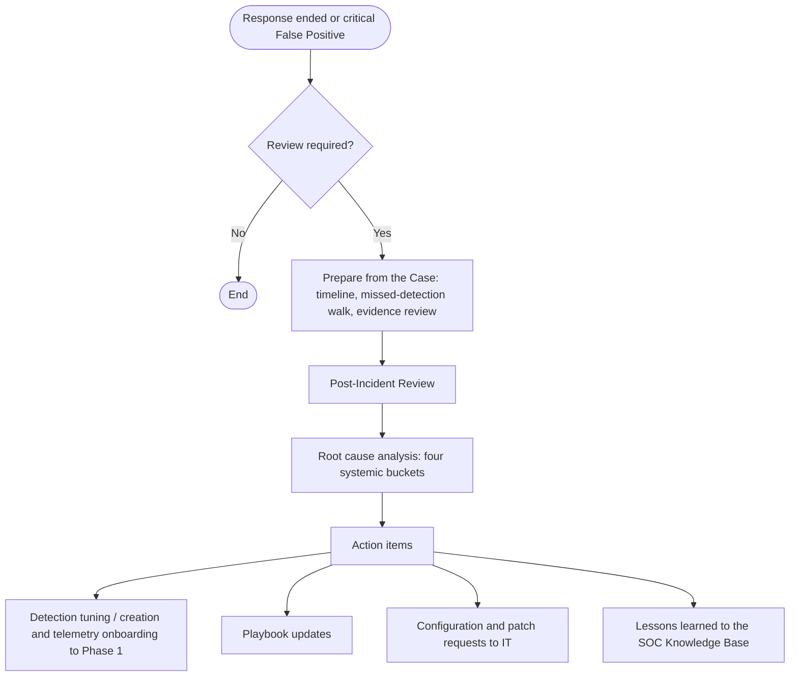

# Phase 4: Post-Incident Activity

The Post-Incident Review is the improvement loop of the framework. It converts what an Incident, or a damaging False Positive, revealed about the organization's telemetry, detections, playbooks and controls into engineering work and institutional knowledge. It is aligned to NIST SP 800-61 Rev. 3 (Table 2, Lessons Learned) and ISO/IEC 27035 (Learn Lessons).

The review itself is a discussion among people. Its inputs are not: the timeline reconstruction, the missed-detection walk and the evidence review below are produced from the Case by any executor — human, automation or agent — before the review, and the review decides on them.

## Inputs & Outputs

| | |
|---|---|
| **Consumes** | A Case whose response has ended ([Incident Response §5](03-response.md#5-transition-to-phase-4)), or a False Positive that caused a critical disruption (§1). The Case as the [Case Schema](../02-Taxonomy/case_schema.md) defines it — its timeline of detection and response actions, its Triage and Investigation Notes and its metrics — is the record the review works on; the framework does not yet define a separate Post-Incident Review report. |
| **Produces** | A blameless root cause analysis (§2); action items (§4) — detection tuning and creation requests to [Phase 1](01-preparation_and_engineering.md), playbook updates, telemetry onboarding, configuration and patch requests to IT; lessons learned recorded in the [SOC Knowledge Base](../01-Foundation/definitions.md#soc-knowledge-base-soc-kb); and the adjudication of the candidate verdict false negatives the Incident surfaced (§3). |

## Process Flowchart

## 1. Trigger Criteria

A Post-Incident Review is mandatory for:

*   every confirmed Incident that was responded to in [Phase 3](03-response.md); Incidents discovered by threat hunting or out-of-band intake are confirmed detection false negatives and always include the missed-detection walk of §3;
*   every False Positive that caused a critical business disruption, such as a containment action applied on a Case later closed as False Positive and rolled back.

An organization may extend the criteria, for example to every Case closed as Insufficient Data whose monitoring watch fired.

The [SOC Manager](../01-Foundation/definitions.md#6-executors-and-functions) convenes the review; the Case assignee presents the Case; the Detection Engineer receives the detection and telemetry action items. Organizations map their own titles onto these functions.

## 2. Blameless Root Cause Analysis

The review is blameless: its object is the system — telemetry, detections, playbooks, controls, autonomy boundaries — not the executor that ran it, human or otherwise. Every review produces a root cause analysis that assigns the failures it finds to one or more of four systemic buckets:

1.  **Telemetry gaps:** missing log sources, parsing errors, or silent failures of the pipeline health monitoring of Phase 1.
2.  **Software flaws:** exploitable vulnerabilities, supply-chain compromises, vulnerable dependencies.
3.  **Configuration and credential weaknesses:** missing multi-factor authentication, weak or reused credentials, excessive privileges, misconfigured controls. A user action that opened the door — a phishing link clicked, a consent granted — is recorded as an awareness action item, not as a root cause.
4.  **Process deficiencies:** playbook gaps, slow handover or approval, ambiguous autonomy boundaries, missing organizational context in the SOC Knowledge Base.

## 3. Review Agenda

1.  **Timeline reconstruction:** walk the Case timeline from T0 — the earliest confirmed malicious event ([Detection & Analysis §2.5](02-detection_and_analysis.md#25-investigation-note-verdict-evidence-record)) — through detection, acknowledgment, verdict, containment and recovery, and compute the Incident's MTTD, MTTA, MTTV, MTTC and MTTR and its approval dwell time ([Operational Metrics §4](../05-Metrics/operational_metrics.md)).
2.  **Detection efficacy and missed-detection walk:** why did the first Alert fire — or, for an Incident not discovered by Phase 1 detection content ([Detection & Analysis §4.3 and §5](02-detection_and_analysis.md)), why did nothing fire? Every attacker action in the timeline for which telemetry existed but no Alert was produced is a **missed detection opportunity** and is captured as a detection-gap action item (§4) recording the discovery channel, whether the miss was a detection miss (no Alert) or a verdict miss (a Case wrongly closed), the ATT&CK techniques, the telemetry domain and the systemic bucket (§2) — the inputs of the recall metrics in [Operational Metrics §5.7](../05-Metrics/operational_metrics.md). The candidate verdict false negatives flagged by the retrospective entity sweep ([Detection & Analysis §3.1](02-detection_and_analysis.md#31-incident-promotion)) are decided here: each prior Case is confirmed as a wrong verdict, with its cause, or dismissed with the reason.
3.  **Evidence review:** the findings retracted during investigation, a verdict reached at Low confidence, and prior Insufficient Data closes on the same entities ([Detection & Analysis §2.4](02-detection_and_analysis.md#24-hypothesis-resolution-verdict-and-confidence)). Each points at a playbook query that asked the wrong question or an enrichment source that answered late, and becomes a playbook action item.
4.  **Response efficacy:** were the pre-authorized containment actions applied at once and did they hold; how much approval dwell time accrued and on which actions; was any action rolled back; did a handover delay the response ([Incident Response §2.1](03-response.md#21-risk-based-autonomy-matrix-for-containment)). A boundary that blocked a needed action, or allowed a damaging one, is a process deficiency (§2).
5.  **Root cause analysis:** state the root causes and assign the systemic buckets.
6.  **Lessons learned:** what the Incident taught about the environment — an approved exception nobody had recorded, a Crown Jewel missing from the inventory, a benign pattern that will recur, a VIP user's normal behavior — is recorded in the SOC Knowledge Base so that the next triage reads it.

## 4. Action Items

The output of the review is a set of tracked action items:

*   detection tuning and creation requests to Phase 1, including the detection-gap items of §3;
*   telemetry onboarding requests for the sources the missed-detection walk found absent;
*   playbook updates: new or corrected hypotheses and queries, changed handover conditions;
*   configuration and patch requests to IT, and awareness items;
*   SOC Knowledge Base entries.

Each item names the systemic bucket it addresses and the risk band of §5.

## 5. Remediation Deadlines

Action items are tracked to closure within a deadline set by their risk. The bands below are reference values; the numbers are an organization policy knob.

*   **Critical risk** (an actively exploited vulnerability, an exposed master credential): 48 hours.
*   **High risk** (missing patches on production servers, weak credentials on critical accounts, a missed detection for a technique in use): 14 days.
*   **Medium risk** (playbook gaps, a non-critical log source absent): 30 days.
*   **Low risk** (rule refinement, documentation and knowledge base updates): 90 days.
