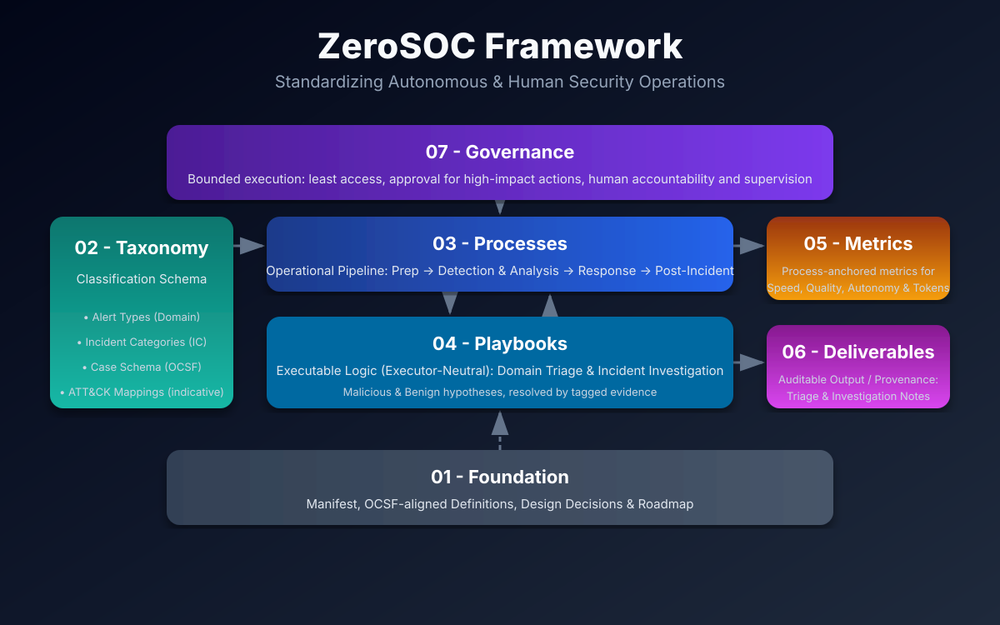
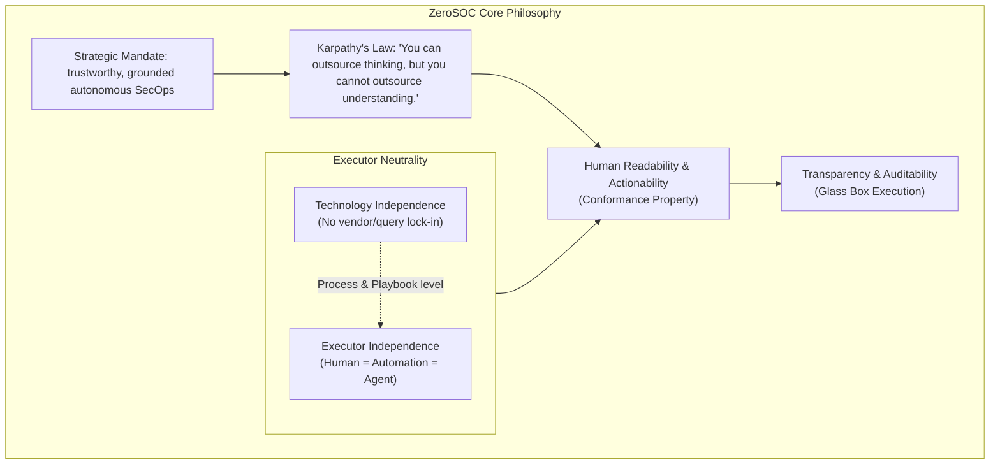
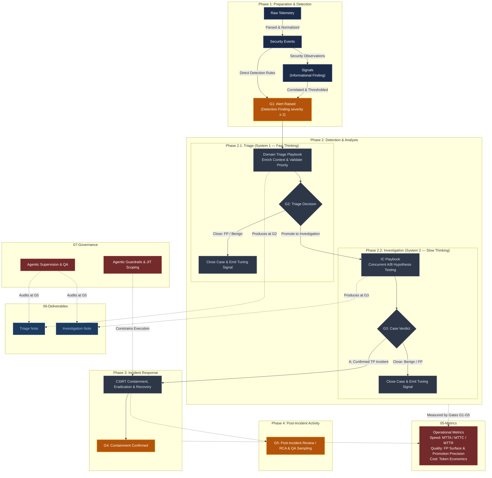
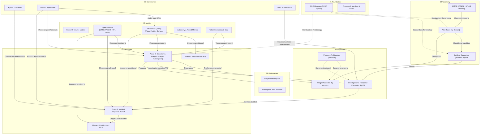

  

# ZeroSOC Framework

The ZeroSOC Framework is a vendor-independent standard for Security Operations, providing an authoritative body of knowledge defining taxonomy, playbooks, performance metrics, and agentic governance.

> **Practitioners — start here →** [Playbook Operating Guide](04-Playbooks/README.md): the operational entry-point that routes any alert through triage → investigation → response.

## Mission

Our mission is to standardize how human analysts, deterministic automation, and AI agents reason about, investigate, and respond to security threats. By formalizing the definitions and providing extensible, hierarchical playbooks, the ZeroSOC Framework aims to build a scalable and mathematically precise approach to modern Detection and Response.

## Core Principles & Philosophy

The ZeroSOC Framework is built upon the strategic mandate of providing a trustworthy foundation for autonomous Security Operations. This philosophy is governed by three core principles detailed in the [Framework Manifest](01-Foundation/framework_manifest.md):

1. **Strategic Mandate for Trustworthy Autonomy:** SecOps agents must execute actions based on grounded, mathematically precise playbooks to guarantee consistency and safety.
2. **Executor Neutrality:** Processes are designed to be independent of both technology (vendor-neutral) and executor (human, deterministic automation, or agent — or any blend of the three). Every step must be fully executable by a qualified analyst reading the documentation alone.
3. **Human Readability as a Conformance Property:** Because *"you can outsource thinking, but you cannot outsource understanding,"* every playbook must remain human-readable and actionable. Human comprehension is the ultimate boundary for agent auditability and transparency.

## Operational Architecture & Pipeline

ZeroSOC structures the flow of security observations from raw telemetry through to incident containment and post-hoc metrics review. The operational pipeline governs how alerts pivot into security cases and resolved outcomes:

* **Domain Triage Playbooks (Phase 2.1):** Initial alert ingest (Gate G1) routes to one of 8 telemetry domains (Endpoint, Cloud, Identity, Network, etc.) where entities are enriched and operational priority is recalibrated. Alerts are either closed as False Positive / Benign Positive (emitting tuning feedback) or promoted to active investigation with a candidate Incident Category (Gate G2).
* **Incident Category (IC) Investigation Playbooks (Phase 2.2):** Promoted cases undergo Concurrent A/B Hypothesis Testing (Malicious vs. Benign) to establish a definitive Case Verdict (Gate G3).
* **Incident Response (Phase 3):** Confirmed True Positive incidents trigger active incident response, tactical containment execution (Gate G4), eradication, and recovery.
* **Deliverables & Provenance:** Every Phase produces structured, human-readable documentation (Triage Note, Investigation Note) with mandatory audit trails.
* **Governance & Metrics:** Agent and automation execution is bound by Least Access / JIT guardrails and audited by human supervision QA (Gate G5), with metrics tracking velocity (MTTA/MTTC/MTTR), stage-differentiated false-positive surfaces, and token economics.

## Core Modules Index

The framework is organized into seven foundational modules:

1. **[01-Foundation](01-Foundation/framework_manifest.md)**: The core manifest, roles and responsibilities (Security Analyst, Detection Engineer, Threat Hunter, SOC Manager), design decisions, roadmap, and OCSF-aligned SOC glossary. Standardizes terminology using OCSF `type_id` bands (Scalar primitive types < 20 e.g., Hostname, IP, Hash vs. Full entity objects ≥ 20 e.g., Endpoint, User, File).
2. **[02-Taxonomy](02-Taxonomy/incident_categories.md)**: An incident classification system focusing on Business Impact. Includes telemetry domain-specific [Alert Type Taxonomy](02-Taxonomy/alert_types.md) and 15 business-impact Incident Categories (IC-01 to IC-15) mapped directly to MITRE ATT&CK/ATLAS threat tactics and techniques.
3. **[03-Processes](03-Processes/00-detection_and_response_lifecycle.md)**: Core operational workflows mapped to NIST CSF 2.0, NIST SP 800-61 Rev. 3, ISO/IEC 27035:2023, and ISO/IEC 27001:2022 (A.5.24 - A.5.28). Outlines the operational phases (Preparation, Detection & Analysis, Response, and Post-Incident).
4. **[04-Playbooks](04-Playbooks/README.md)**: Hierarchical playbook standard powered by Concurrent A/B Hypothesis Testing (Malicious vs. Benign). Divided into domain-specific **Triage Playbooks** (normalizing/enriching alerts at Gate G2) and Incident-Category-specific **Investigation & Response Playbooks** (Gate G3).
5. **[05-Metrics](05-Metrics/operational_metrics.md)**: Process-anchored speed metrics (MTTD, MTTA, MTTV, MTTC, MTTR, HITL Dwell Time), stage-differentiated False-Positive Surface (Promotion Precision, Case Noise Rate), paired autonomy-quality metrics, and Token Economics (compute/LLM pricing).
6. **[06-Deliverables](06-Deliverables/README.md)**: Fill-in templates and golden exemplars for the framework's written deliverables (Triage Note and Investigation Note), with mandatory provenance metadata for Glass Box audit trails.
7. **[07-Governance](07-Governance/agentic_guardrails.md)**: Guardrails for autonomous execution (automation and AI agents) in SecOps. Details Least Access identity (JIT Scoping, Time-Boxing), standard HITL containment payloads, autonomous action boundaries, and OSINT data egress restrictions.

## Module & Component Relationships

The diagram below illustrates how standard definitions, governance rules, playbook architectures, operational processes, and metrics interface with each other in the ZeroSOC framework:

## Versioning & Document Status

Every framework document declares a **release status** in its frontmatter — `draft` / `development` / `stable` / `deprecated` — defined, together with the promotion rules and the framework's Semantic Versioning scheme (`MAJOR.MINOR.PATCH`, e.g. `v0.1.0`), in the [Framework Manifest](01-Foundation/framework_manifest.md#versioning--document-release-status). Adopters conform to a tagged release, never to the live repository; [log.md](log.md) doubles as the changelog.

## Standard Alignment

ZeroSOC is designed to interoperate with and build upon the industry's most trusted standards. This section is the **canonical registry of the exact standard/framework versions** ZeroSOC is currently built upon; other documents reference standards by name only and defer to the versions recorded here.

*   **Strategic Governance:** NIST CSF 2.0
*   **Tactical Incident Handling:** NIST SP 800-61 Rev. 3
*   **Process Governance:** ISO/IEC 27035:2023 & ISO/IEC 27001:2022
*   **Data Schema:** Open Cybersecurity Schema Framework (OCSF) v1.8.0
*   **Threat Tactics & Techniques:** MITRE ATT&CK® v19
*   **Cost & Billing Normalization:** FinOps Foundation FOCUS v1.2 (ratified 2025)
*   **Regulatory Compliance:** Designed to support EU NIS2 and DORA auditing requirements and notification timelines.

## License, Trademarks & Contributing

The ZeroSOC Framework is licensed under the **[Apache License 2.0](LICENSE)** (see also [NOTICE](NOTICE) and [DD-15](01-Foundation/design_decisions.md)).

Contributions are welcomed! Before contributing, please review our **[Contributing Guidelines](CONTRIBUTING.md)** and ensure all commits are signed off under the Developer Certificate of Origin (DCO).

The license grants no rights to the "ZeroSOC" name (License §6); naming and commercial-branding rules are defined in the **[Trademark Policy](TRADEMARKS.md)**.

---
*An open standard for the next generation of Security Operations.*
